# The gem-skills Logo

An SVG diamond: the orthographic projection of a real 3D model of a cut stone, in one color like a real gem, with seven animations that need no JavaScript. The mark spins and floats by default.

## SVG

<p align="center">
  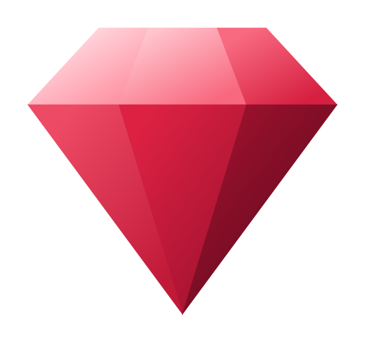
</p>

## Playground

Playground: https://brillout.github.io/gem-skills-logo

## Color

A gem is one color, so a palette is a tone ramp of that color — highlight, body, shadow — and every facet takes its tone from how it faces the light. [`color-palettes.ts`](./color-palettes.ts) has ready-made stones (Spinel, Ruby, Sapphire, Emerald, Amethyst, Onyx, Gold, …); pick any of them in the playground, or pass a single color and the highlight and shadow are derived.

## Animations

Every animation is an independent toggle with its own timing parameters, rendered as native SVG animation (SMIL) — so the files play inside `` tags and READMEs like this one, and combine freely (the mark above combines `spin` and `float`). At t&nbsp;=&nbsp;0 each animation rests in the static pose, so tools that don't animate (PNG export, favicons) show exactly the un-animated mark. Each file below shows one animation alone.

|                             `colorFlow`                             |                           `sweep`                           |                           `glint`                           |                          `glow`                           |
| :-----------------------------------------------------------------: | :---------------------------------------------------------: | :---------------------------------------------------------: | :-------------------------------------------------------: |
| 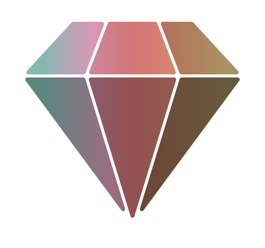 |  |  |  |
|   The light circles the stone; the tones flow across the facets.    |           A band of light passes over the facets.           |            Sparkles pop at the stone's corners.             |          A soft highlight breathes on the table.          |

|                          `spin`                           |                           `float`                           |                           `pulse`                           |
| :-------------------------------------------------------: | :---------------------------------------------------------: | :---------------------------------------------------------: |
|  | 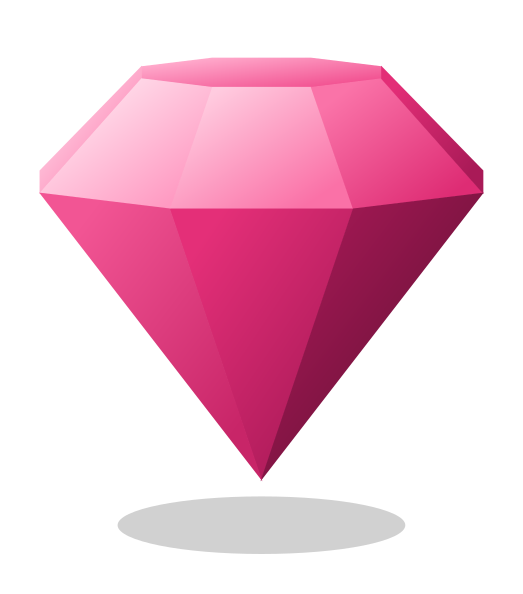 |  |
|    The stone revolves about its axis, with real depth.    |              The stone bobs above its shadow.               |           The "skill unlocked" pop, with a flash.           |

| Animation   | Parameters                                                                 |
| ----------- | -------------------------------------------------------------------------- |
| `colorFlow` | `colorFlowDuration`                                                        |
| `sweep`     | `sweepDuration`, `sweepHold`, `sweepAngle`, `sweepWidth`, `sweepIntensity` |
| `glint`     | `glintDuration`, `glintCount`, `glintSize`, `glintColor`                   |
| `glow`      | `glowDuration`, `glowRadius`, `glowIntensity`                              |
| `spin`      | `spinDuration`, `spinSteps`                                                |
| `float`     | `floatDuration`, `floatHeight`, `floatShadow`                              |
| `pulse`     | `pulseHold`, `pulseDuration`, `pulseScale`, `pulseFlash`                   |

Each parameter is documented in [`diamond.ts`](./diamond.ts).

## PNG

All `1024px` but with different paddings (the stone at rest, without any animation):

|                        `none`                        |                        `small`                        |                        `medium`                        |                        `large`                        |
| :--------------------------------------------------: | :---------------------------------------------------: | :----------------------------------------------------: | :---------------------------------------------------: |
| 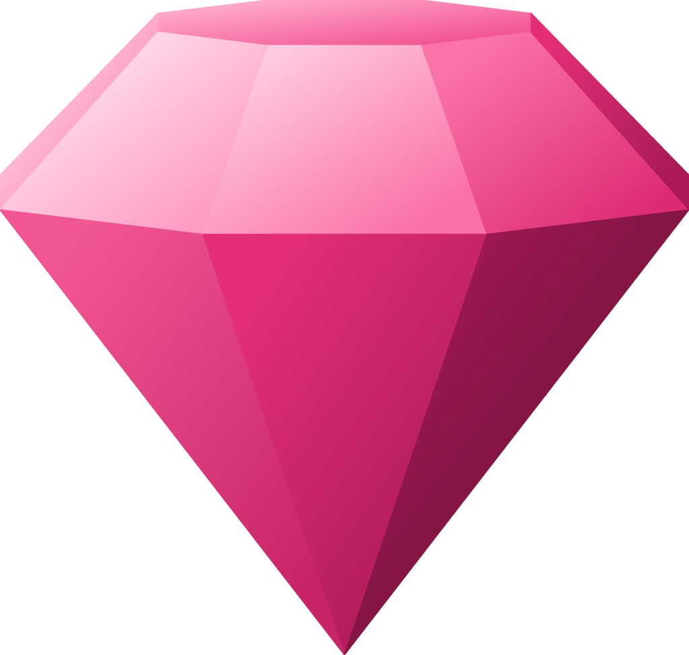 | 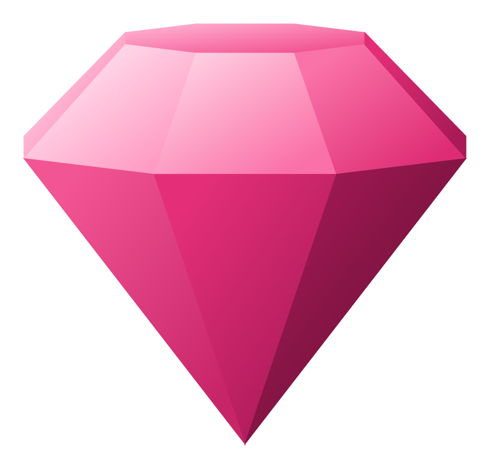 | 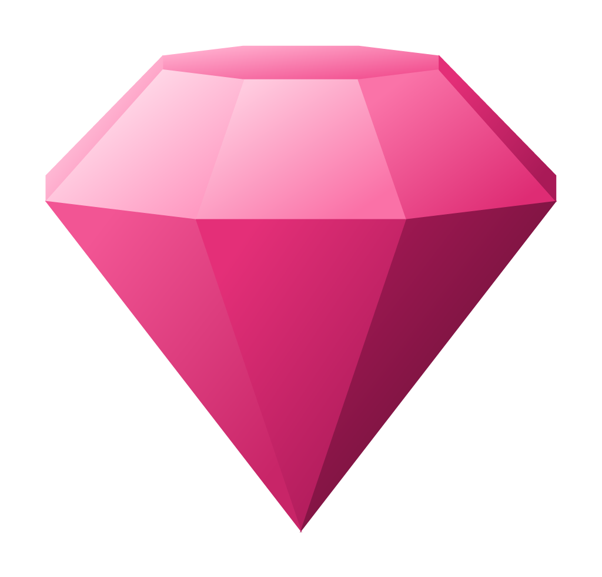 | 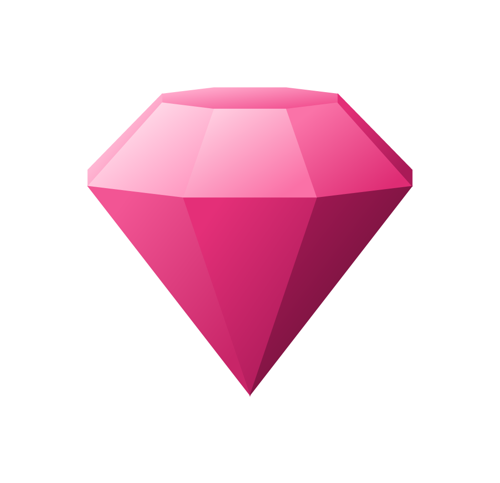 |

For custom size & padding, go to the [playground](https://brillout.github.io/gem-skills-logo).

## CLI

```bash
pnpm install
pnpm run node-ts cli.ts logo.svg --spin=true --sweep=true                    # any parameter as --name=value
pnpm run node-ts cli.ts logo.svg --colors=#e4f0ff,#7cb4ff,#2f6de6,#1b45b4,#0f2670   # a tone ramp (this one is Sapphire)
pnpm run node-ts cli.ts logo.svg --colors=#16b56c                            # one color; highlight and shadow derived
pnpm run node-ts cli.ts logo.svg --pitch=15 --yaw=22.5                       # look down onto the table, turned
pnpm run node-ts cli.ts logo.png --pngSize=512 --padding=large
```

## Development

```bash
pnpm run dev     # playground at http://localhost:3000
pnpm run build   # regenerate diamond.svg, the PNGs and animations/*.svg
```
